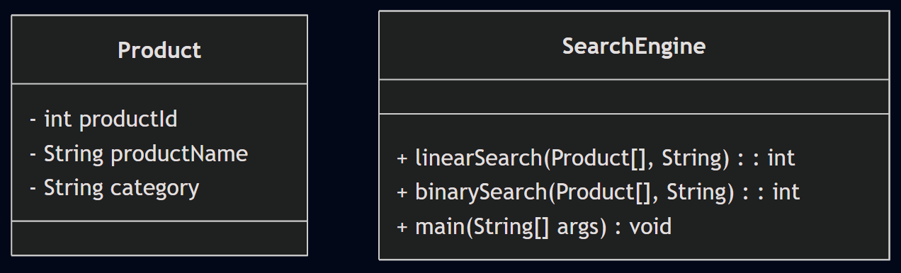

# 🛒 E-commerce Platform Search Function

A Java-based implementation to demonstrate and compare **Linear Search** and **Binary Search** for finding products in an e-commerce system.

---

## 📘 Understanding Asymptotic Notation

### What is Big O Notation?

Big O notation expresses the **time complexity** or **efficiency** of an algorithm, especially as input size grows:

| Notation | Description       | Example Algorithm      |
|----------|-------------------|------------------------|
| O(1)     | Constant time      | Accessing an array element |
| O(n)     | Linear time        | Linear Search          |
| O(log n) | Logarithmic time   | Binary Search          |
| O(n²)    | Quadratic time     | Bubble Sort            |

---

## ⚠️ Best, Average, Worst-Case Scenarios (Search)

| Algorithm     | Best Case     | Average Case     | Worst Case     |
|---------------|---------------|------------------|----------------|
| Linear Search | O(1)          | O(n)             | O(n)           |
| Binary Search | O(1)          | O(log n)         | O(log n)       |

> 📝 Binary Search **requires a sorted array**.

---

## 🧾 Class Setup

```java
public class Product {
    int productId;
    String productName;
    String category;

    public Product(int productId, String productName, String category) {
        this.productId = productId;
        this.productName = productName;
        this.category = category;
    }
}
```

### 🔍 Linear Search

```java
public static int linearSearch(Product[] products, int id) {
    for (int i = 0; i < products.length; i++) {
        if (products[i].productId == id) {
            return i;
        }
    }
    return -1;
}
```
### 🔎 Binary Search (Array must be sorted by productId)
```java
public static int binarySearch(Product[] products, int id) {
    int low = 0, high = products.length - 1;
    while (low <= high) {
        int mid = (low + high) / 2;
        if (products[mid].productId == id) return mid;
        if (products[mid].productId < id) low = mid + 1;
        else high = mid - 1;
    }
    return -1;
}
```

### 🧪 Sample Main Program
```java
import java.util.Arrays;

public class MainSearchEngine {
    public static void main(String[] args) {
        Product[] products = {
            new Product(101, "Phone", "Electronics"),
            new Product(202, "Shirt", "Clothing"),
            new Product(303, "Laptop", "Electronics"),
            new Product(404, "Book", "Stationery"),
        };

        // Sort for binary search
        Arrays.sort(products, (a, b) -> a.productId - b.productId);

        int idToSearch = 303;

        int indexLinear = linearSearch(products, idToSearch);
        int indexBinary = binarySearch(products, idToSearch);

        System.out.println("Linear Search found at index: " + indexLinear);
        System.out.println("Binary Search found at index: " + indexBinary);
    }
}

```
### ✅ Sample Output:
```yml
Linear Search Result: Product{ID=4, Name='Shoes', Category='Fashion'}
Binary Search Result: Product{ID=4, Name='Shoes', Category='Fashion'}
```
---
## 📷 UML Diagram

---
---

---
### ⏱️ Time Complexity Comparison

| Algorithm       | Time Complexity |
|----------------|-----------------|
| Linear Search   | O(n)            |
| Binary Search   | O(log n)        |


#### 📌 Binary search is faster for large, sorted datasets.
### ✅ Conclusion
- Linear Search is simple but slower.

- Binary Search is much more efficient but needs sorted data.

- Choosing the right search strategy depends on the data structure and access frequency.

### 📌 Topics Covered
- Time Complexity (Big O)

- Best/Average/Worst Case

- Linear vs Binary Search

- Java Array Sorting and Searching
----


